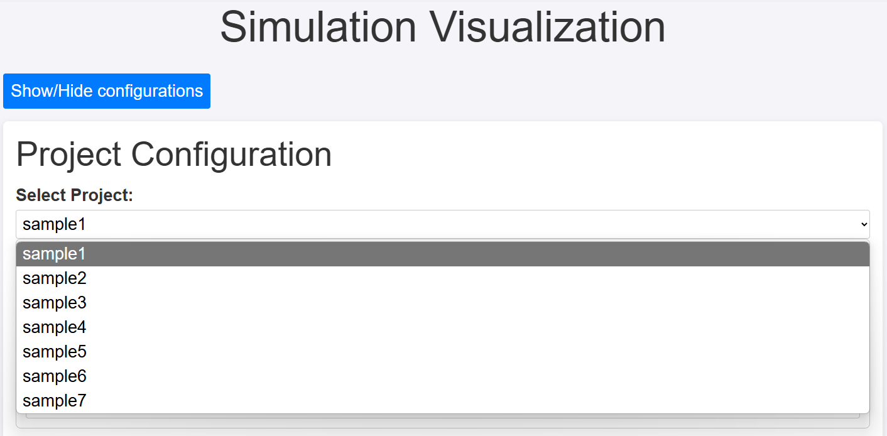
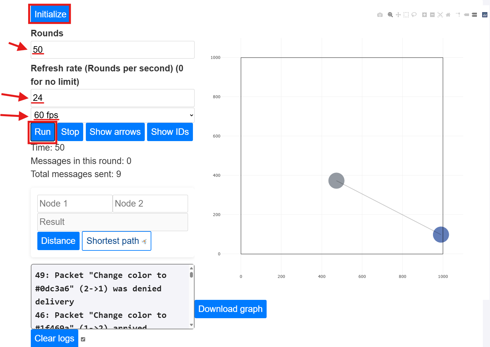
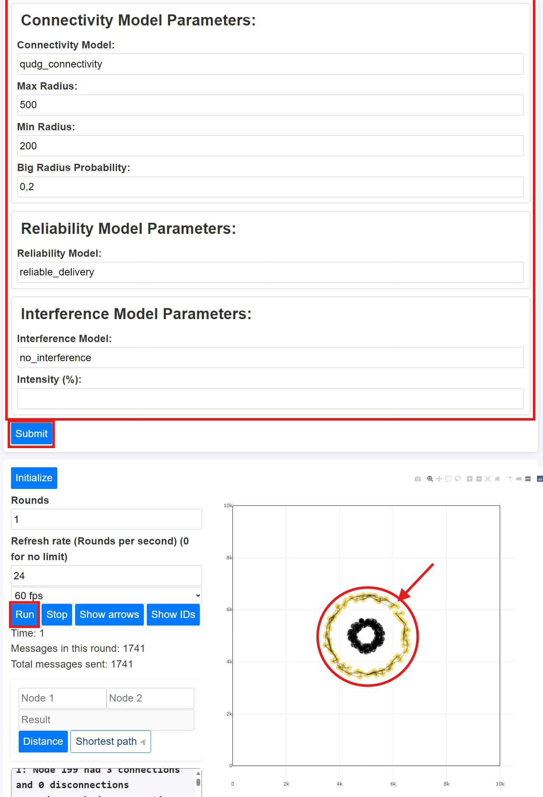
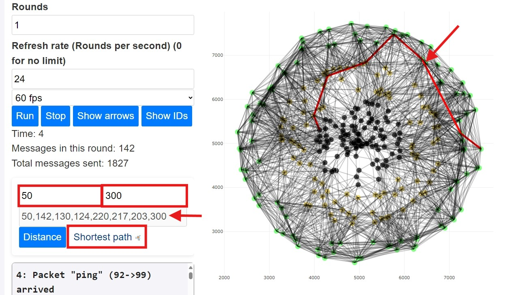
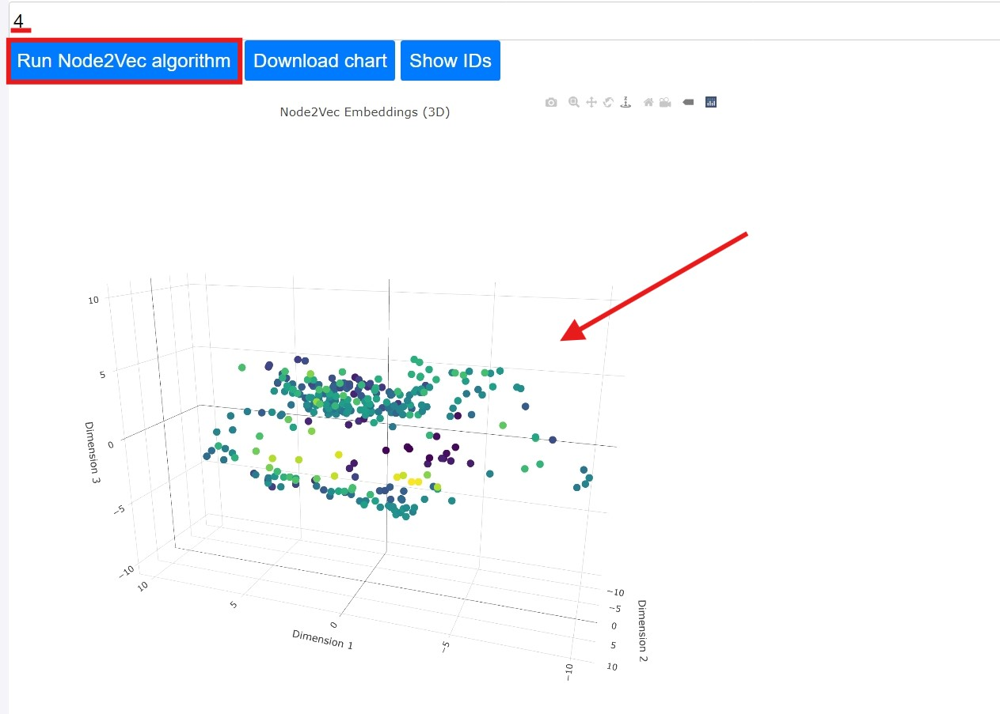

# Um Framework Modular em Python para Simulação de Algoritmos de Redes

O objetivo deste software é ser um simulador de algoritmos de redes simples, construído em Python, modular, de facil uso e expansível.
No artigo "Um Framework Modular em Python para Simulação de Algoritmos de Redes" apresentamos o funcionamento deste software e casos de uso sob o seguinte resumo: "*Para impulsionar os avanços nos algoritmos de redes de computadores, é essencial utilizar simuladores atualizados que permitam testes em ambientes controlados. Assim, propomos o SNAPPY, uma ferramenta de código aberto projetada para analisar e programar a troca de mensagens de nós, movimentação, conectividade e distribuição. SNAPPY é feito em Python, integrado com algoritmos de redes complexas e Inteligência Artificial. Sua arquitetura é modular, o que garante adaptabilidade para diversas pesquisas e extensibilidade. Como exemplo, apresentamos três casos de uso: troca de mensagens ping-pong, aplicação do algoritmo de Dijkstra e o Node2Vec embedding.*"

# Estrutura do readme.md

Neste arquivo README.md, apresentamos a estrutura do artefato, com informações sobre a instalação, execução e reprodução dos experimentos.

A estrutura do repositório é a seguinte:

| Raiz
| - README.md (este arquivo)
| - env.yml (arquivo de dependências do ambiente conda)
| - LICENSE (licença do software)
| - *...[arquivos] (outros arquivos)*
| - **doc/** (arquivos guia da documentação)
| - **experimentos-reprodutiveis-tutorial/** (tutorial para reprodução dos experimentos)
| - **how-to-install/** (tutorial para instalação do software)
| - **apps/mobsinet/** (arquivos do software)
| - ***...[pastas]** (arquivos de configuração do Django)*

# Selos Considerados

- Artefatos Disponíveis (SeloD); 
- Artefatos Funcionais (SeloF);
- Artefatos Sustentáveis (SeloS);
- Experimentos Reprodutíveis (SeloR)

# Informações básicas

- Python 3.12 ou superior
- Um navegador moderno (Chrome, Firefox, Edge, Opera, ...)
    O navegador deve ter JavaScript moderno ativado.
- 4 GB de RAM ou mais
- 1 GB de espaço livre em disco ou mais
- Anaconda ou Miniconda instalados
- Processador de 2,5 GHz ou mais rápido (recomendado)
- Resolução de tela de 1440 x 900 ou superior (recomendado)


# Dependências

As dependências utilizadas estão listadas em **environment.yml**, mas grande parte delas são dependências das bibliotecas do Python listadas abaixo:
  - django=4.2.18
  - networkx=3.4.2
  - node2vec=0.3.0
  - numpy=1.26.4
  - gensim=4.3.2
  - matplotlib=3.10.0
  - scipy=1.12.0

Essas mesmas dependências estão listadas no arquivo **env.yml**.

# Preocupações com segurança

O SNAPPY foi projeto para ser de uso seguro em qualquer plataforma e sistema que siga os requisitos mínimos, não havendo preocupações com segurança.

# Instalação

1.Instale o Python
    Você pode baixar o Python aqui.

2.Instale o Miniconda (ou Anaconda)
    Você pode instalar o Miniconda aqui.

3.Instale o Firefox (ou outro navegador moderno)
    Você pode baixar o Firefox aqui.

4.Instale o Git
    Você pode baixar o Git aqui.

5.Clone o repositório
```bash
$ git clone repository_url_here.git
```

6.Crie um novo ambiente
```bash
$ conda env create-f env.yml
```
```bash
$ conda activate mobenv
```

7.Faça as migrations
```bash
$ python manage.py makemigrations
```
```bash
$ python manage.py migrate
```

#### Executando o servidor

```
$ python manage.py runserver
```

#### Acessando a aplicação

Você pode acessar a aplicação através do link [http://localhost:8000/mobsinet/graph/](http://localhost:8000/mobsinet/graph/).


*Um tutorial mais detalhado pode ser encontrado na pasta **[how-to-install/](how-to-install/)**.

# Teste mínimo

1. Com o SNAPPY instalado, você pode navegar até a pasta raíz e executar os seguintes comandos:
```bash
$ source activate mobenv
```
```bash
$ python manage.py runserver
```
2. Abra o navegador e acesse [http://localhost:8000/mobsinet/graph/](http://localhost:8000/mobsinet/graph/) e selecione o projeto que deseja executar.


3. Clique no botão "Initialize" para inicializar a simulação.
4. Configure o número de rodadas, a taxa de atualização e o fps da visualização.
5. Clique no botão "Run" para iniciar a simulação.


#### Adicionando novo lote de nós à simulação
1. Inicie uma simulação com a configuração desejada.
2. Clique no botão "Show/Hide add nodes form" para abrir o formulário.
3. Preencha o formulário com a configuração desejada para a nova turma de nós.
4. Clique no botão "Add to the simulation" para adicionar a nova turma de nós à simulação.
5. Clique no botão "Run" para iniciar a simulação.


#### Executando o algoritmo de caminho mais curto
1. Execute uma simulação com as configurações desejadas.
2. Coloque os IDs de dois nós nos campos "Node 1" e "Node 2".
3. Clique no botão "Shortest path" para executar o algoritmo de caminho mais curto.
4. Veja o resultado na saída e no gráfico.


#### Executando o algoritmo Node2Vec
1. Execute uma simulação com as configurações desejadas.
2. Coloque as dimensões dos "embeddings" no campo "Dimensions".
3. Clique no botão "Run Node2Vec algorithm".
4. Veja o resultado no gráfico.



# Experimentos

## Reivindicação Ping Pong

Primeiramente, vamos reproduzir o experimento de ping pong. O experimento
consiste em dois nós que enviam mensagens um para o outro. As mensagens
são enviadas com uma cor aleatória no conteúdo, que é usada pelo nó receptor
para se colorir.

*Se você ainda não fez o tutorial #Getting Started no README, faça isso
    antes de reproduzir o experimento.

1.Navegue até a pasta raiz do SNAPPY no seu terminal.
2.Execute o seguinte comando para iniciar o simulador:
```bash
$ source activate mobenv
```
```bash
$ python manage.py runserver
```
3.Abra seu navegador e acesse [http://localhost:8000/mobsinet/graph/](http://localhost:8000/mobsinet/graph/).
4.Abra o menu de configurações clicando no botão “Show/Hide configurations” caso ainda não esteja aberto.
5.Selecione o projeto “Sample1” no dropdown de seleção de projeto.
6.Verifique se o restante das configurações está definida conforme abaixo:
    - Nó: sample1:pingpong_node
    - Número de Nós: 2
    - Tamanho dos nós: 10 # você pode alterar esse valor para visualizar melhor os nós
    - Dimensão X: 1000
    - Dimensão Y: 1000
    - Modelo de Distribuição: linear_dist
    - Orientação: horizontal
    - Posição da linha: 0
    - Número de nós (para a seção Parâmetros do Modelo de Distribuição): 2
    - Modelo de Mobilidade: random_walk
    - Intervalo de Velocidade: 0,
    - Intervalo de Direção (radianos): 0,6.
    - Priorizar Velocidade: Não
    - Tempo de Viagem: 70
    - Modelo de Conectividade: qudg_connectivity
    - Raio Máximo: 1000
    - Raio Mínimo: 800
    - Probabilidade de Raio Grande: 0,
    - Modelo de Confiabilidade: reliable_delivery
    - Modelo de Interferência: probability_interference
    - Intensidade: 5
    - Modelo de Transmissão de Mensagem: random_time
    - Tempo Mínimo de Transmissão Aleatória: 2
    - Tempo Máximo de Transmissão Aleatória: 4
7.Clique no botão “Submit” no final do formulário.
8.Clique no botão “Initialize” para redefinir as variáveis da simulação e posicionar os nós no cenário.
9.Defina o número de rodadas para 60.
10.Defina a taxa de atualização para 15.
11.Defina os FPS da simulação para 60.
12.Clique no botão “Run” para iniciar a simulação.
Você deverá ver os nós se movendo no cenário e enviando mensagens um para o
outro. As mensagens são coloridas, e os nós receptores mudam sua cor para a
cor da mensagem recebida. Você pode ver quando uma mensagem é descartada
ou entregue com sucesso no console integrado. Quando os nós perdem a conexão
ou se reconectam, uma mensagem é exibida no console de logs.
13.Para manter os IDs dos nós sempre visíveis, clique e segure no botão
“Show IDs”, mova o mouse para fora do botão e solte o botão do mouse.
14.Para manter as setas sempre visíveis, repita o procedimento do passo 13,
mas com o botão “Show Arrows”.
15.Para parar a simulação, clique no botão “Stop”.
16.Insira os IDs dos nós nos campos “Node 1” e “Node 2” e clique no botão
“Distance” para visualizar a distância euclidiana entre os dois nós.

## Reivindicação Shortest Path + Node2Vec

Agora vamos reproduzir os experimentos do caminho mais curto com Node2Vec.
O experimento de caminho mais curto consiste em encontrar o menor caminho
entre dois nós no cenário. O experimento Node2Vec consiste em executar o
algoritmo Node2Vec no cenário atual.

- Se você ainda não fez o tutorial #Getting Started no README, faça isso antes de reproduzir o experimento.
1.Navegue até a pasta raiz do SNAPPY no seu terminal.
2.Execute o seguinte comando para iniciar o simulador:
```bash
    $ source activate mobenv
```
```bash
$ python manage.py runserver
```
3.Abra seu navegador e acesse [http://localhost:8000/mobsinet/graph/](http://localhost:8000/mobsinet/graph/).
4.Abra o menu de configurações clicando no botão “Show/Hide configurations” caso ainda não esteja aberto.
5.Selecione o projeto “Sample4” no dropdown de seleção de projeto.
6.Verifique se o restante das configurações estão definidas conforme abaixo:
    - Mensagens NACK Ativadas: Sim
    - Nó: sample5:ping_node
    - Número de Nós: 100
    - Tamanho dos nós: 3
    - Dimensão X: 10000
    - Dimensão Y: 10000
    - Modelo de Distribuição: circular_dist
    - Número de nós (para a seção Parâmetros do Modelo de Distribuição): 100
    - Ponto Médio: 5000,
    - Direção de Rotação: anti-horário
    - Raio: 500
    - Modelo de Mobilidade: random_walk
    - Intervalo de Velocidade: 100,
    - Intervalo de Direção (radianos): 0,6.
    - Priorizar Velocidade: Não
    - Distância de Viagem: 500
    - Modelo de Conectividade: qudg_connectivity
    - Raio Máximo: 500
    - Raio Mínimo: 200
    - Probabilidade de Raio Grande: 0,
    - Modelo de Confiabilidade: reliable_delivery
    - Modelo de Interferência: no_interference
    - Modelo de Transmissão de Mensagem: random_time
    - Tempo Mínimo de Transmissão Aleatória: 1
    - Tempo Máximo de Transmissão Aleatória: 10
7.Clique no botão “Submit” no final do formulário.
8.Clique no botão “Initialize” para redefinir as variáveis da simulação e
posicionar os nós no cenário.
9.Clique no botão “Show/Hide add nodes form” para abrir o formulário.
10.Altere os seguintes parâmetros no formulário:
    - Raio (para a seção Parâmetros do Modelo de Distribuição): 1500
    - Raio Máximo (para a seção Parâmetros do Modelo de Conectividade): 1000
    - Raio Mínimo (para a seção Parâmetros do Modelo de Conectividade): 500
11.Clique no botão "Add to the simulation" para adicionar o novo lote de nós à simulação.
12.Volte ao formulário de Adicionar Nós e altere os seguintes parâmetros:
    - Raio (para a seção Parâmetros do Modelo de Distribuição): 2500
    - Raio Máximo (para a seção Parâmetros do Modelo de Conectividade): 1200
13.Clique no botão "Add to the simulation" para adicionar o novo lote de
nós à simulação.
14.Defina o número de rodadas para 1.
15.Clique no botão “Run” para iniciar a simulação.
16.Insira os IDs dos nós nos campos “Node 1” e “Node 2” e clique no botão “Shortest Path” para executar o algoritmo de caminho mais curto
(no artigo, testamos com os nós 150 e 300).
Você deverá ver o menor caminho entre os dois nós no grafo com setas vermelhas.
17.Insira o número de dimensões no campo “Dimensions” e clique no botão “Run Node2Vec Algorithm” para rodar o algoritmo Node2Vec (no artigo, testamos com 4 dimensões).
Você deverá ver o resultado do algoritmo Node2Vec no gráfico.

*Um tutorial mais detalhado pode ser encontrado na pasta **[experimentos-reprodutiveis-tutorial/](experimentos-reprodutiveis-tutorial/)**.

# LICENSE

GNU General Public License v3.0 (GPL-3.0)

Disponível em [LICENSE](LICENSE)

