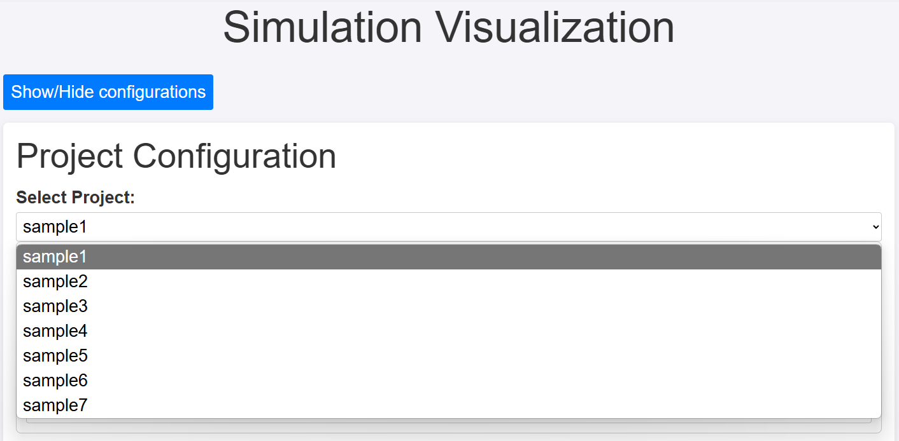
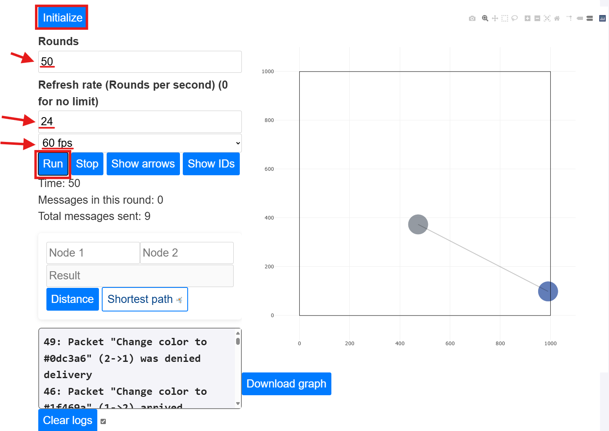
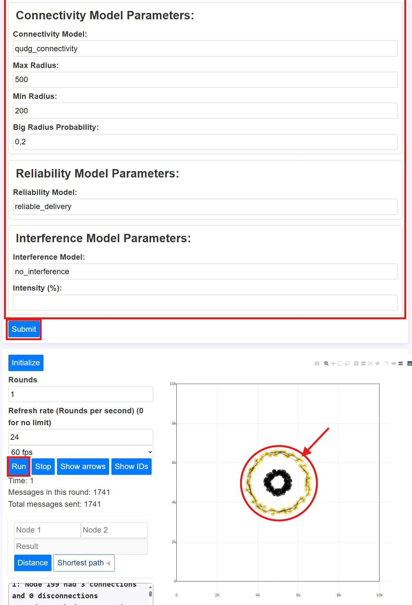
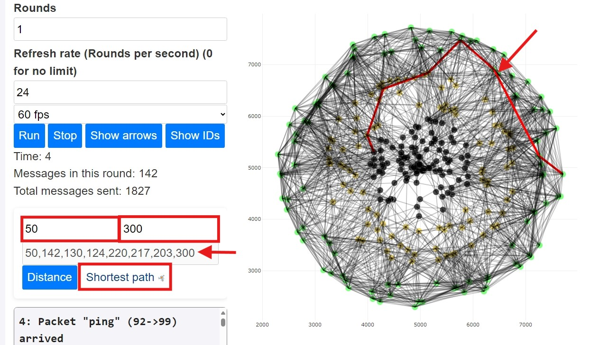
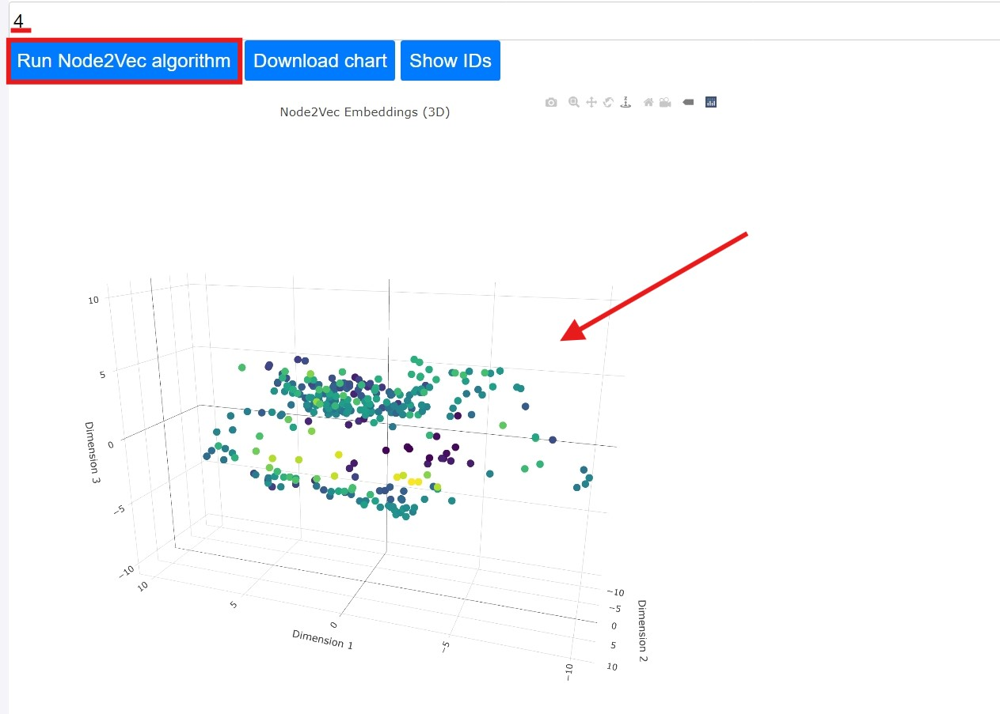

# SNAPPY: A Simulator for Network Algorithms and Protocols in Python

## Getting Started

1. Requirements:
You need to have a modern browser (Chrome, Firefox, Edge, Opera, ...) and python installed on your computer. You can download python from [here](https://www.python.org/downloads/).

2. Install conda
You can install anaconda or miniconda. We will use miniconda.

3. Create a new environment
```bash
$ conda env create -f env.yml
```
```bash
$ conda activate mobenv
```

4. Making migrations
```bash
$ python manage.py makemigrations
```
```bash
$ python manage.py migrate
```

5. Run server
```bash
$ python manage.py runserver
```

6. Open browser and go to [http://localhost:8000/mobsinet/graph/](http://localhost:8000/mobsinet/graph/)

## Creating projects

1. Create a new folder in the projects directory
2. Create a config.json file in the new folder
```json
{
    "project": "project_name_here",
    "simulation_rounds": 100,
    "simulation_name": "NameOfTheSimulation",
    "simulation_refresh_rate": 0,
    "num_nodes": 30,
    "node_size": 5,
    "dimX": 1000,
    "dimY": 1000,
    "node": "project_name:node_implementation",
    "distribution_model": "distribution_model",
    "distribution_model_parameters": {
        "orientation": "horizontal",
        "line_position": 50,
        "number_of_nodes": 30,
        "midpoint": [400,400],
        "rotation_direction": "anti-clockwise",
        "radius": 200
    },
    "mobility_model": "mobility_model",
    "mobility_model_parameters": {
        "speed_range": [0,20],
        "direction_range": [0,6.283185307179586],
        "prioritize_speed": false,
        "travel_distance": null,
        "travel_time": 70
    },
    "connectivity_model": "connectivity_model",
    "connectivity_model_parameters": {
        "max_radius": 1000,
        "min_radius": 800,
        "big_radius_probability": 0.75
    },
    "message_transmission_model": "message_transmission_model",
    "message_transmission_model_parameters": {
        "constant_transmission_time": 3,
        "random_transmission_min_time": 2,
        "random_transmission_max_time": 4
    },
    "reliability_model": "reliability_model",
    "reliability_model_parameters": {},
    "interference_model": "interference_model",
    "interference_model_parameters": {
        "intensity": 5
    },
    "nack_messages_enabled": false
}
```
3. Create a node implementation in your project (optional)
You must create a `nodes` folder in your project folder and create a python file with the node implementation. The node implementation must inherit from the `AbcNode` class. You can see the available methods in the `AbcNode` class. Here is an example of a node implementation:
```python
from ....models.nodes.abc_node import AbcNode

# Useful imports
from ....global_vars import Global
from ....network_simulator import simulation
from ....configuration.sim_config import config


class MyProjectNode(AbcNode):
    def __init__(self, *args, **kwargs):
        super().__init__(*args, **kwargs)
        self.your_node_attribute = None

    def handle_messages(self, inbox):
        # Handle received messages
        pass

    def check_requirements(self):
        # Requirements to init the node in the simulation
        return super().check_requirements()

    def init(self):
        # Initialize the node
        return super().init()

    def on_neighboorhood_change(self):
        # Actions to be taken when the neighborhood changes
        return super().on_neighboorhood_change()

    def post_step(self):
        # Actions to be taken after each step
        return super().post_step()

    def pre_step(self):
        # Actions to be taken before each step
        return super().pre_step()

    # Add other methods here, you can see the available methods in the AbcNode class


node = MyProjectNode # Every node implementation must have a node variable

```
4. Create a new model in your project (optional)
You must create a folder for each type of model in your project folder (`mobility_models`,`distribution_models`, `connectivity_models`, `message_transmission_models`, `reliability_models`, `interference_models`), and create a python file with the model implementation. The model implementation must inherit from the the base class of each model type, (`AbcMobilityModel`, `AbcDistributionModel`, `AbcConnectivityModel`, `AbcMessageTransmissionModel`, `AbcReliabilityModel`, `AbcInterferenceModel`). You can see the available methods in the `AbcModel` class. You can see examples of model implementations in the `apps/mobsinet/simulator/defaults` folder.


## Executing projects

1. With the project installed, you can navigate to the project folder and run the following command:
```bash
$ source activate mobenv
```
```bash
$ python manage.py runserver
```	

2. Open browser and go to [http://localhost:8000/mobsinet/graph/](http://localhost:8000/mobsinet/graph/) and select the project you want to run.


3. Click on the "Initialize" button to initialize the simulation.
4. Configure number of rounds, refresh rate and visualization fps.
5. Click on the "Run" button to start the simulation.


## Adding new batches of nodes to the simulation

1. Start a simulation with the desired configuration.
2. Click on button "Show/Hide add nodes form" to open the form.
3. Fill the form with the desired configuration for the new batch of nodes.
4. Click on the "Add to the simulation" button to add the new batch of nodes to the simulation.
5. Click on the "Run" button to start the simulation.


## Executing shortest path algorithm
1. Start a simulation with the desired configuration.
2. Inputs the source and destination nodes.
3. Click on the "Shortest path" button to run the shortest path algorithm.
4. See the result in the output and in the graph.


## Executing Node2Vec algorithm

1. Start a simulation with the desired configuration.
2. Input the dimensions of the embedding.
3. Click on the "Run Node2Vec algorithm".
4. See the result in the chart.


---
### Commands to export dependencies

```bash
$ conda env export --no-builds | grep -v "^prefix:"  > environment.yml
```
```bash
$ conda env export | grep -v "^prefix:" | sed -E 's/(=.+)//' > environment-noversion.yml
```
```bash
$ conda env export | grep -v "^prefix:" > environment-builds.yml 
```
