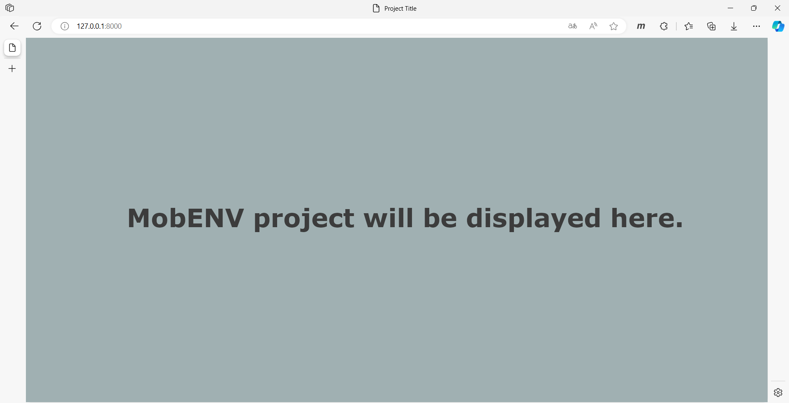

# Windows Installation *(non-official)*

> ⚠️ These are a non-official tutorial for a installation on a 64-bit based Windows SO. Some dependencies from the project can't be installed on Windows, because it maybe some things don't work as expected.

> ℹ️ These tutorial uses **conda** to create python environments, but you can use other environment manager such as "python venv" or install all dependencies listed on [conda-env-list-win64.yaml](./conda-env-list-win64.yaml) file directly. In these cases, you can jump to [Step five](#step-five).

### First step
Install Anaconda or Miniconda on your machine.
[Tutorial for Anaconda/Miniconda Installation](https://conda.io/projects/conda/en/latest/user-guide/install/index.html#)

After install make sure you have conda command installed by using the following command on your **Anaconda Promp**/**Anaconda Powershell Prompt**:
```shell
> conda --version
```
the output should be:
```shell
conda <version_here>
```
Example:
```shell
(base) C:\> conda --version
conda 24.5.0
```

### Step two

Clone the repository (navigate to the wanted directory first)
```shell
git clone https://github.com/bps90/MobENV.git
```

### Step three

On your Anaconda Promp/Anaconda Powershell Prompt navigate to the project folder and run the following command:
```shell
> conda env create -f conda-env-list-win64.yaml
```

### Step four

> ℹ️ From this step down, every time you close and reopen your prompt/shell or restart your machine you need to do it again to get the project up and running!

At your Anaconda Prompt/Anaconda Powershell Prompt run:
```shell
> conda activate mobenv-virtualenv
```
Example:
```shell
(base) C:\> conda activate mobenv-virtualenv

(mobenv-virtualenv) C:\>
```

### Step five

Navigate to the project directory and run the following commands:
```shell
> python manage.py makemigrations
> python manage.py migrate
> python manage.py runserver
```
Example:
```shell
(mobenv-virtualenv) C:\> cd Users\yourusername\MobENV

(mobenv-virtualenv) C:\Users\yourusername\MobENV> python manage.py makemigrations
No changes detected

(mobenv-virtualenv) C:\Users\yourusername\MobENV> python manage.py migrate
Operations to perform:
  Apply all migrations: admin, auth, contenttypes, sessions
Running migrations:
  Applying contenttypes.0001_initial... OK
  Applying auth.0001_initial... OK
  Applying admin.0001_initial... OK
  .
  .
  .
  Applying ... OK

(mobenv-virtualenv) C:\Users\yourusername\MobENV> python manage.py runserver
Watching for file changes with StatReloader
Performing system checks...

System check identified no issues (0 silenced).
July 01, 2024 - 00:23:11
Django version 4.1, using settings 'mobcore.settings'
Starting development server at http://127.0.0.1:8000/
Quit the server with CTRL-BREAK.
```

### Step six

Open your browser and paste the obtained URL


## 🎉 Alright, you made it work!